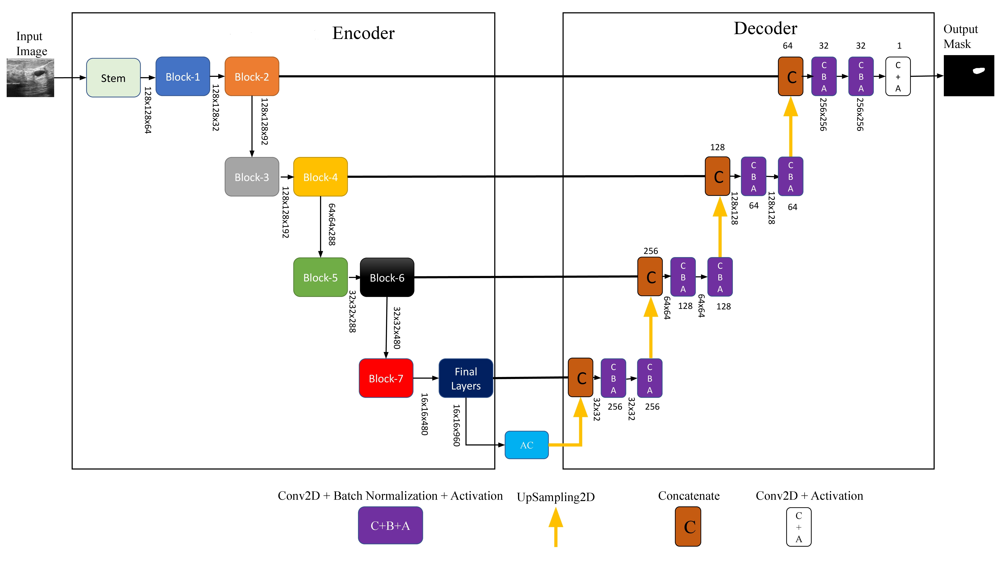

# EfficientU-Net for Breast Tumor Segmentation

This repository contains the implementation of EfficientU-Net, a novel deep learning method for breast tumor segmentation in ultrasound (US) images. The model combines the power of EfficientNetB7 as an encoder with an Atrous Convolution (AC) block to improve segmentation accuracy.

## Architecture

The EfficientU-Net architecture consists of:
- **Encoder**: EfficientNetB7 pre-trained on ImageNet
- **AC Block**: Atrous Convolution block with multiple dilation rates
- **Decoder**: Standard U-Net decoder with skip connections

## Prerequisites

- Python 3.7+
- TensorFlow 2.8.0+
- Other dependencies listed in `requirements.txt`

## Installation

1. Clone the repository:
```bash
git clone https://github.com/MohsinFurkh/EfficientU-Net.git
cd EfficientU-Net
```

2. Install the required packages:
```bash
pip install -r requirements.txt
```

## Usage

### Training

1. Prepare your dataset in the appropriate format (images and corresponding masks).
2. Update the `load_data()` function in `train.py` to load your dataset.
3. Run the training script:
```bash
python train.py
```

### Model Architecture

To view the model architecture:
```python
from model import build_efficientunet
model = build_efficientunet()
model.summary()
```

## Model Architecture



The proposed EfficientU-Net architecture consists of three main components:

1. **Encoder (EfficientNetB7)**:
   - Pre-trained on ImageNet
   - Extracts hierarchical features at different scales
   - Captures both low-level and high-level features
   

2. **Atrous Convolution (AC) Block**:
   - Captures multi-scale contextual information
   - Uses parallel dilated convolutions with different rates
   - Preserves spatial resolution while expanding the receptive field
   

3. **Decoder**:
   - Progressive upsampling with skip connections
   - Recovers spatial information from encoder features
   - Produces the final segmentation mask

## Results
### Training Curves

*Figure 1: Training progress of the proposed model on BUSI dataset: dice coefficient(left) and dice loss (right) results for validation compared with UNet, UNet++, and Attention UNet*

### Box Plots
.png)
*Figure 2: Boxplots of Dice scores for the combined test samples of BUSI dataset and Dataset-B. Boxes indicate the score range of methods, the color line inside each box represents the median value, and all values outside the whiskers are considered outliers, marked with the dot symbol*

.png)
*Figure 3: Boxplots of IoU scores for the combined test samples of BUSI dataset and Dataset-B. Boxes indicate the score range of methods, the color line inside each box represents the median value, and all values outside the whiskers are considered outliers, marked with the dot symbol*

### Quantitative Results

| Networks | Params (M) | Inference Speed (secs) | GFLOPs | BUSI Dataset | | Dataset B | |
|----------|------------|------------------------|--------|--------------|-------------|------------|-------------|
|          |            |                        |        | Dice         | IoU         | Dice       | IoU         |
| **U-Net** | 9.34 | 1.67 | 70.6 | 0.8880 (±0.016) | 0.7989 (±0.026) | 0.8148 (±0.099) | 0.6961 (±0.128) |
| **U-Net++** | 9.68 | 1.54 | 98.4 | 0.8961 (±0.003) | 0.8119 (±0.005) | 0.8880 (±0.016) | 0.7989 (±0.026) |
| **Attention U-Net** | 8.65 | 1.60 | 60.7 | 0.8933 (±0.007) | 0.8074 (±0.013) | 0.8317 (±0.108) | 0.7226 (±0.142) |
| **U-Net3+** | 7.90 | 1.68 | 33.7 | 0.8820 (±0.024) | 0.8132 (±0.072) | 0.8514 (±0.057) | 0.7991 (±0.025) |
| **U2-Net** | 52.94 | 1.79 | 22.0 | 0.9015 (±0.023) | 0.8204 (±0.032) | 0.9102 (±0.058) | 0.8381 (±0.165) |
| **TransUnet** | 407 | 1.93 | 54.6 | **0.9103 (±0.054)** | **0.8342 (±0.052)** | 0.9189 (±0.138) | 0.8433 (±0.119) |
| **Proposed EfficientU-Net** | **5.76** | **1.47** | **19.35** | 0.9045 (±0.007) | 0.8258 (±0.012) | **0.9227 (±0.011)** | **0.8567 (±0.020)** |

*Table 1: Segmentation results of the proposed EfficientU-Net compared with state-of-the-art methods on BUSI dataset and Dataset B. Values in parentheses indicate standard deviation. Bold values indicate best performance in each column.*


### Qualitative Results

.png)
*Figure 4: Segmentation results for the BUSI dataset: original images (Col 1), Ground Truth (Col 2), UNet (Col 3), UNet++ (Col 4), Attention UNet (Col 5), and the proposed EfficientU-Net (Col 6)*


### Ablation Study

| Network | Params (M) | GFLOPs | Inference Time (secs) | Dice | IoU |
|---------|------------|--------|----------------------|------|-----|
| **U-Net** | 9.34 | 70.6 | 1.67 | 0.8880 (±0.016) | 0.7989 (±0.026) |
| **EfficientU-Net without AC block** | 5.73 | 16.7 | 1.44 | 0.8947 (±0.014) | 0.8033 (±0.008) |
| **EfficientU-Net with ASPP** | 6.31 | 24.1 | 1.52 | 0.8991 (±0.034) | 0.8122 (±0.022) |
| **EfficientU-Net with AC block** | **5.76** | **19.35** | **1.47** | **0.9045 (±0.007)** | **0.8258 (±0.012)** |

*Table 2: Results of the ablation study comparing different variants of the proposed architecture. The proposed EfficientU-Net with AC block achieves the best performance while maintaining computational efficiency. Standard deviations are shown in parentheses.*


## Dataset

The model was trained on the BUSI and UDIAT datasets.

## Citation

If you use this implementation in your research, please cite:

```
@article{efficientunet2023,
  title={EfficientU-Net: A Novel Deep Learning Method for Breast Tumor Segmentation},
  author={[Your Names]},
  journal={Neural Processing Letters},
  year={2023},
  doi={10.1007/s11063-023-11333-x}
}
```
## License

This project is licensed under the MIT License - see the [LICENSE](LICENSE) file for details.
